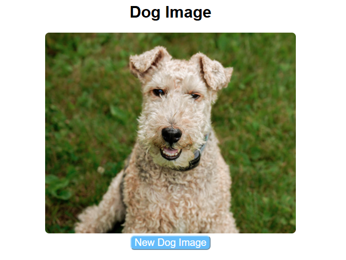

# Random Dog Image App

A React application that fetches and displays random dog images using the Dog CEO API. The application automatically loads a dog image when the page first renders and allows users to fetch a new image by clicking a button.

# Features

- Fetches a random dog image when the application loads
- Displays a loading message while waiting for the API response
- Allows users to fetch a new dog image with a button click
- Uses React Hooks (useState and useEffect)
- Handles API errors gracefully
- Displays images with consistent sizing and styling

## Technologies Used

- React
- Vite
- JavaScript
- Dog CEO API
- Screenshot

## Screenshot



## Installation

1. Clone the repository:

```bash
git clone <https://github.com/Matt20Swanberg/react-hooks-simple-data-fetching-lab-vite>
```

2. Navigate to the project directory:
```bash
cd <project-folder>
```

3. Install dependencies:
```bash
npm install
```

## Usage

Start the development server:

```bash
npm run dev
```

Open your browser and navigate to the local URL displayed in the terminal (typically http://localhost:5173).

When the application loads, a random dog image will automatically be fetched and displayed. Click the **New Dog Image** button to retrieve another random image from the API.

## Running Tests
```bash
npm run test
```

## API Endpoint

The application retrieves random dog images from:

https://dog.ceo/api/breeds/image/random

## Project Structure

```text
src/
├──  App.jsx
└── __tests__/
    └── App.test.jsx
```

## Author

Created by Matthew Swanberg as part of a React Hooks + Simple Data Fetching lab assignment (Course 5, Module 2).
